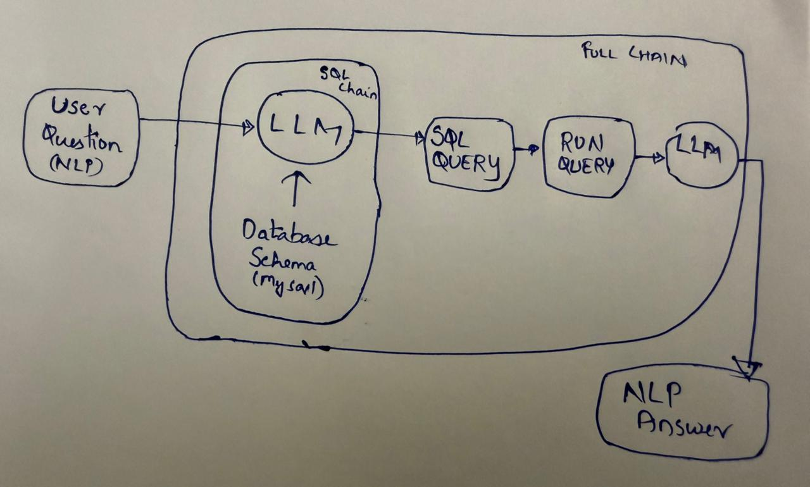

# MySQL Database Chatbot using Gemini AI

Here we are building a natural language SQL chatbot using Google's Gemini AI! This project demonstrates how to develop a chatbot capable of interpreting natural language queries, generating SQL statements, and retrieving results from a MySQL database—all within an intuitive and user-friendly interface.

## Features

- **Natural Language Processing**: Utilizes Gemini AI for understanding and responding to user queries.
- **SQL Query Generation**: Dynamically creates SQL queries based on user input.
- **Database Interaction**: Connects seamlessly to a MySQL database, demonstrating efficient data retrieval.
- **Streamlit GUI**: Provides an interactive interface for users to submit queries and receive results effortlessly.
- **Python-based**: Built entirely using Python, showcasing modern programming paradigms.

## How the Chatbot Works

The chatbot seamlessly bridges natural language queries and database interactions. Below are the key steps:

1. **User Query Submission**: The user enters a query through the Streamlit interface.
2. **Schema Retrieval**: The system fetches the database schema to understand table and column structures.
3. **Prompt Template Generation**: A structured prompt guides the AI in generating accurate SQL queries.
4. **SQL Generation with Gemini AI**: The model processes the prompt and creates an optimized SQL query.
5. **Database Query Execution**: The generated SQL is executed against the MySQL database.
6. **Response Formatting**: The result is transformed into a human-readable format.
7. **User-Friendly Output**: The final response is displayed in the chat interface for the user.

## Architecture Overview

The application employs a modular design with various chains and components working together to streamline natural language processing and database operations.

Below is a visual representation of the architecture:



## AI Tools and Agents

- **Gemini AI**: Used for SQL generation and natural language processing tasks.
- **LangChain**: Guides the workflow, manages prompts, and ensures smooth operations across different stages.

## Installation

1. Clone the repository:
    ```sh
    git clone <repository_url>
    cd <repository_directory>
    ```

2. Create a virtual environment:
    ```sh
    python -m venv venv
    source venv/bin/activate  # On Windows use `venv\Scripts\activate`
    ```

3. Install the dependencies:
    ```sh
    pip install -r requirements.txt
    ```

## Configuration

1. Create a `.env` file in the root directory of the project and add your Google Gemini API key:
    ```env
    GEMINI_API_KEY="your_api_key_here"
    ```

## Usage

1. Start your local MySQL server.
2. Run the Streamlit application:
    ```sh
    streamlit run app.py
    ```
3. Open your web browser and navigate to `http://localhost:8501` to interact with the application.

## Project Structure

- `app.py`: The main Streamlit application file.
- `populate_db.py`: A script to initialize the MySQL database with sample tables and data.
- `requirements.txt`: The list of Python dependencies.
- `.env`: Environment variables file (ignored in the repository).


